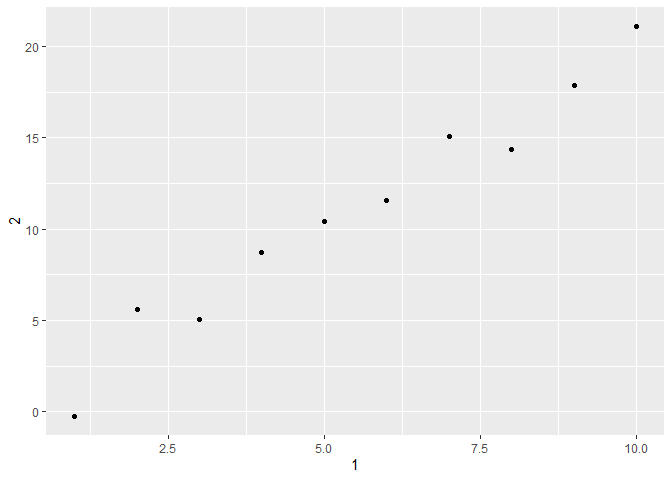

## 10.5.1: How can you tell if an object is a tibble? (Hint: try printing mtcars, which is a regular data frame).  

```r
print(mtcars)%>%
  .$"cyl"
```

```
##                      mpg cyl  disp  hp drat    wt  qsec vs am gear carb
## Mazda RX4           21.0   6 160.0 110 3.90 2.620 16.46  0  1    4    4
## Mazda RX4 Wag       21.0   6 160.0 110 3.90 2.875 17.02  0  1    4    4
## Datsun 710          22.8   4 108.0  93 3.85 2.320 18.61  1  1    4    1
## Hornet 4 Drive      21.4   6 258.0 110 3.08 3.215 19.44  1  0    3    1
## Hornet Sportabout   18.7   8 360.0 175 3.15 3.440 17.02  0  0    3    2
## Valiant             18.1   6 225.0 105 2.76 3.460 20.22  1  0    3    1
## Duster 360          14.3   8 360.0 245 3.21 3.570 15.84  0  0    3    4
## Merc 240D           24.4   4 146.7  62 3.69 3.190 20.00  1  0    4    2
## Merc 230            22.8   4 140.8  95 3.92 3.150 22.90  1  0    4    2
## Merc 280            19.2   6 167.6 123 3.92 3.440 18.30  1  0    4    4
## Merc 280C           17.8   6 167.6 123 3.92 3.440 18.90  1  0    4    4
## Merc 450SE          16.4   8 275.8 180 3.07 4.070 17.40  0  0    3    3
## Merc 450SL          17.3   8 275.8 180 3.07 3.730 17.60  0  0    3    3
## Merc 450SLC         15.2   8 275.8 180 3.07 3.780 18.00  0  0    3    3
## Cadillac Fleetwood  10.4   8 472.0 205 2.93 5.250 17.98  0  0    3    4
## Lincoln Continental 10.4   8 460.0 215 3.00 5.424 17.82  0  0    3    4
## Chrysler Imperial   14.7   8 440.0 230 3.23 5.345 17.42  0  0    3    4
## Fiat 128            32.4   4  78.7  66 4.08 2.200 19.47  1  1    4    1
## Honda Civic         30.4   4  75.7  52 4.93 1.615 18.52  1  1    4    2
## Toyota Corolla      33.9   4  71.1  65 4.22 1.835 19.90  1  1    4    1
## Toyota Corona       21.5   4 120.1  97 3.70 2.465 20.01  1  0    3    1
## Dodge Challenger    15.5   8 318.0 150 2.76 3.520 16.87  0  0    3    2
## AMC Javelin         15.2   8 304.0 150 3.15 3.435 17.30  0  0    3    2
## Camaro Z28          13.3   8 350.0 245 3.73 3.840 15.41  0  0    3    4
## Pontiac Firebird    19.2   8 400.0 175 3.08 3.845 17.05  0  0    3    2
## Fiat X1-9           27.3   4  79.0  66 4.08 1.935 18.90  1  1    4    1
## Porsche 914-2       26.0   4 120.3  91 4.43 2.140 16.70  0  1    5    2
## Lotus Europa        30.4   4  95.1 113 3.77 1.513 16.90  1  1    5    2
## Ford Pantera L      15.8   8 351.0 264 4.22 3.170 14.50  0  1    5    4
## Ferrari Dino        19.7   6 145.0 175 3.62 2.770 15.50  0  1    5    6
## Maserati Bora       15.0   8 301.0 335 3.54 3.570 14.60  0  1    5    8
## Volvo 142E          21.4   4 121.0 109 4.11 2.780 18.60  1  1    4    2
```

```
##  [1] 6 6 4 6 8 6 8 4 4 6 6 8 8 8 8 8 8 4 4 4 4 8 8 8 8 4 4 4 8 6 8 4
```

## I think I can see the chart with columns and rows when I code "print()" and I can see a row if I want to extract the column through ".$".  

## 10.5.2: Compare and contrast the following operations on a data.frame and equivalent tibble. What is different? Why might the default data frame behaviours cause you frustration? 

```r
df <- data.frame(abc = 1, xyz = "a")
df$x
```

```
## [1] a
## Levels: a
```

```r
df[, "xyz"]
```

```
## [1] a
## Levels: a
```

```r
df[, c("abc", "xyz")]
```

```
##   abc xyz
## 1   1   a
```

```r
tib<-tibble(abc=1, xyz="a")
tib[,"xyz"]
```

```
## # A tibble: 1 x 1
##   xyz  
##   <chr>
## 1 a
```

```r
tib[,c("abc","xyz")]
```

```
## # A tibble: 1 x 2
##     abc xyz  
##   <dbl> <chr>
## 1     1 a
```

## When I type "tib$x", I can only get the null consequence, so I delete this line and I also can get two meaningful diagrams. The only distinction is the formating of the consequence of the first diagram. Is it a vector for data.frame?  

## 10.5.4: Practice referring to non-syntactic names in the following data frame by:

Extracting the variable called 1.

Plotting a scatterplot of 1 vs 2.

Creating a new column called 3 which is 2 divided by 1.

Renaming the columns to one, two and three.  

```r
what<-tibble(`1`=1:10, `2`=`1`*2+rnorm(length(`1`)))%>%
  print()
```

```
## # A tibble: 10 x 2
##      `1`    `2`
##    <int>  <dbl>
##  1     1 -0.222
##  2     2  5.63 
##  3     3  5.08 
##  4     4  8.73 
##  5     5 10.4  
##  6     6 11.6  
##  7     7 15.1  
##  8     8 14.4  
##  9     9 17.9  
## 10    10 21.1
```

```r
what[["1"]]
```

```
##  [1]  1  2  3  4  5  6  7  8  9 10
```

```r
ggplot(what)+
geom_point(mapping=aes(x =`1`,y =`2`))
```

<!-- -->

```r
what[["3"]]<-what$`2`/what$`1`
print(what)
```

```
## # A tibble: 10 x 3
##      `1`    `2`    `3`
##    <int>  <dbl>  <dbl>
##  1     1 -0.222 -0.222
##  2     2  5.63   2.81 
##  3     3  5.08   1.69 
##  4     4  8.73   2.18 
##  5     5 10.4    2.08 
##  6     6 11.6    1.93 
##  7     7 15.1    2.15 
##  8     8 14.4    1.80 
##  9     9 17.9    1.98 
## 10    10 21.1    2.11
```

```r
what <- rename(what, one = `1`, two = `2`, three = `3`)%>%
  print()
```

```
## # A tibble: 10 x 3
##      one    two  three
##    <int>  <dbl>  <dbl>
##  1     1 -0.222 -0.222
##  2     2  5.63   2.81 
##  3     3  5.08   1.69 
##  4     4  8.73   2.18 
##  5     5 10.4    2.08 
##  6     6 11.6    1.93 
##  7     7 15.1    2.15 
##  8     8 14.4    1.80 
##  9     9 17.9    1.98 
## 10    10 21.1    2.11
```

## I have a problem when I try to use the code "mutate" because I seem not to be allowed to "add the column" to the dataset through "mutate" but it really shows there is an extra column in the dataset. 

```r
mutate(what, `3`=two/one)
```

```
## # A tibble: 10 x 4
##      one    two  three    `3`
##    <int>  <dbl>  <dbl>  <dbl>
##  1     1 -0.222 -0.222 -0.222
##  2     2  5.63   2.81   2.81 
##  3     3  5.08   1.69   1.69 
##  4     4  8.73   2.18   2.18 
##  5     5 10.4    2.08   2.08 
##  6     6 11.6    1.93   1.93 
##  7     7 15.1    2.15   2.15 
##  8     8 14.4    1.80   1.80 
##  9     9 17.9    1.98   1.98 
## 10    10 21.1    2.11   2.11
```

## 10.5.5: What does tibble::enframe() do? When might you use it?

```r
enframe(c(a=1, b=2, c=34, z=789))
```

```
## # A tibble: 4 x 2
##   name  value
##   <chr> <dbl>
## 1 a         1
## 2 b         2
## 3 c        34
## 4 z       789
```

## It can convert two equally long vectors into a tibble. 

## 11.2.2.1: What function would you use to read a file where fields were separated with “|”?

## I google this and I find it is for "read_delim()" but can you give an example about how to use it?  

## 11.2.2.4: Sometimes strings in a CSV file contain commas. To prevent them from causing problems they need to be surrounded by a quoting character, like " or '. By default, read_csv() assumes that the quoting character will be ". What argument to read_csv() do you need to specify to read the following text into a data frame? 

```r
read_csv("x,y\n1,'a,b'", quote="'")
```

```
## # A tibble: 1 x 2
##       x y    
##   <dbl> <chr>
## 1     1 a,b
```

##11.2.2.5: Identify what is wrong with each of the following inline CSV files. What happens when you run the code?  

```r
read_csv("a,b\n1,2,3\n4,5,6")
```

```
## Warning: 2 parsing failures.
## row col  expected    actual         file
##   1  -- 2 columns 3 columns literal data
##   2  -- 2 columns 3 columns literal data
```

```
## # A tibble: 2 x 2
##       a     b
##   <dbl> <dbl>
## 1     1     2
## 2     4     5
```

```r
read_csv("a,b,c\n1,2\n1,2,3,4")
```

```
## Warning: 2 parsing failures.
## row col  expected    actual         file
##   1  -- 3 columns 2 columns literal data
##   2  -- 3 columns 4 columns literal data
```

```
## # A tibble: 2 x 3
##       a     b     c
##   <dbl> <dbl> <dbl>
## 1     1     2    NA
## 2     1     2     3
```

```r
read_csv("a,b\n\"1")
```

```
## Warning: 2 parsing failures.
## row col                     expected    actual         file
##   1  a  closing quote at end of file           literal data
##   1  -- 2 columns                    1 columns literal data
```

```
## # A tibble: 1 x 2
##       a b    
##   <dbl> <chr>
## 1     1 <NA>
```

```r
read_csv("a,b\n1,2\na,b")
```

```
## # A tibble: 2 x 2
##   a     b    
##   <chr> <chr>
## 1 1     2    
## 2 a     b
```

```r
read_csv("a;b\n1;3")
```

```
## # A tibble: 1 x 1
##   `a;b`
##   <chr>
## 1 1;3
```

## For the diagram one, there are three values for each row but only two columns, so the last column has disappeared.  
## For the diagram two, there are only two columns, so for the first vector row, the last missing one is filled with "NA"; for the second vector row, the last excessive one disappears.  
## For the diagram three, there are two columns but there is only one value in the vector row, so the missing value is filled with "NA".  
## For the diagram four, the value is the as the column name and there should be some problems with the value.  
## For the diagram five, the ";" is used instead of "," to separate different columns but this cannot be recognized as "," by the studio, so the tibble will have only one column and one row.  

## 11.3.5.1: What are the most important arguments to locale()?  
## I think it is absolutely important arguments for all types of data import (, but I think it is better to process the data in advance through "csv" document).  

## 11.3.5.2: What happens if you try and set decimal_mark and grouping_mark to the same character? What happens to the default value of grouping_mark when you set decimal_mark to ","? What happens to the default value of decimal_mark when you set the grouping_mark to "."?

## It is an error. 

```r
locale(decimal_mark=",")
```

```
## <locale>
## Numbers:  123.456,78
## Formats:  %AD / %AT
## Timezone: UTC
## Encoding: UTF-8
## <date_names>
## Days:   Sunday (Sun), Monday (Mon), Tuesday (Tue), Wednesday (Wed), Thursday
##         (Thu), Friday (Fri), Saturday (Sat)
## Months: January (Jan), February (Feb), March (Mar), April (Apr), May (May),
##         June (Jun), July (Jul), August (Aug), September (Sep), October
##         (Oct), November (Nov), December (Dec)
## AM/PM:  AM/PM
```

## It tends to let the period "." to be figured as grouping mark.   

```r
locale(grouping_mark = ",")
```

```
## <locale>
## Numbers:  123,456.78
## Formats:  %AD / %AT
## Timezone: UTC
## Encoding: UTF-8
## <date_names>
## Days:   Sunday (Sun), Monday (Mon), Tuesday (Tue), Wednesday (Wed), Thursday
##         (Thu), Friday (Fri), Saturday (Sat)
## Months: January (Jan), February (Feb), March (Mar), April (Apr), May (May),
##         June (Jun), July (Jul), August (Aug), September (Sep), October
##         (Oct), November (Nov), December (Dec)
## AM/PM:  AM/PM
```

## It tends to lect the period "." to be digured as decimal mark. 

## 11.3.5.3: I didn’t discuss the date_format and time_format options to locale(). What do they do? Construct an example that shows when they might be useful.

## Sorry, I think I have no idea!!!!!!

## 11.3.5.7: Generate the correct format string to parse each of the following dates and times

```r
d1 <- "January 1, 2010"
d2 <- "2015-Mar-07"
d3 <- "06-Jun-2017"
d4 <- c("August 19 (2015)", "July 1 (2015)")
d5 <- "12/30/14" # Dec 30, 2014
t1 <- "1705"
t2 <- "11:15:10.12 PM"

parse_date(d1, "%B %d, %Y")
```

```
## [1] "2010-01-01"
```

```r
parse_date(d2, "%Y-%b-%d")
```

```
## [1] "2015-03-07"
```

```r
parse_date(d3, "%d-%b-%Y")
```

```
## [1] "2017-06-06"
```

```r
parse_date(d4, "%B %d (%Y)")
```

```
## [1] "2015-08-19" "2015-07-01"
```

```r
parse_date(d5, "%m/%d/%y")
```

```
## [1] "2014-12-30"
```

```r
parse_time(t1, "%H%M")
```

```
## 17:05:00
```

```r
parse_time(t2, "%H:%M:%OS %p")
```

```
## 23:15:10.12
```


