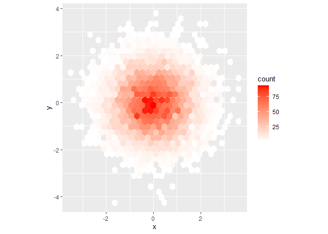

_13.2.1.1: Imagine you wanted to draw (approximately) the route each plane flies from its origin to its destination. What variables would you need? What tables would you need to combine?_

I need the the variable "origin" and "dest" from the chart "flights", and the exact location of each airport with longtitude "lon" and latitude "lat" from the chart "airports". 

```r
flights_route<-flights%>%
  inner_join(select(airports, c(origin=faa, origin_lon=lon, origin_lat=lat)), by="origin") %>%
  inner_join(select(airports, c(dest=faa, dest_lon=lon, dest_lat=lat)), by="dest") %>%
  glimpse()
```

```
## Observations: 329,174
## Variables: 23
## $ year           <int> 2013, 2013, 2013, 2013, 2013, 2013, 2013, 2013, 2013...
## $ month          <int> 1, 1, 1, 1, 1, 1, 1, 1, 1, 1, 1, 1, 1, 1, 1, 1, 1, 1...
## $ day            <int> 1, 1, 1, 1, 1, 1, 1, 1, 1, 1, 1, 1, 1, 1, 1, 1, 1, 1...
## $ dep_time       <int> 517, 533, 542, 554, 554, 555, 557, 557, 558, 558, 55...
## $ sched_dep_time <int> 515, 529, 540, 600, 558, 600, 600, 600, 600, 600, 60...
## $ dep_delay      <dbl> 2, 4, 2, -6, -4, -5, -3, -3, -2, -2, -2, -2, -2, -1,...
## $ arr_time       <int> 830, 850, 923, 812, 740, 913, 709, 838, 753, 849, 85...
## $ sched_arr_time <int> 819, 830, 850, 837, 728, 854, 723, 846, 745, 851, 85...
## $ arr_delay      <dbl> 11, 20, 33, -25, 12, 19, -14, -8, 8, -2, -3, 7, -14,...
## $ carrier        <chr> "UA", "UA", "AA", "DL", "UA", "B6", "EV", "B6", "AA"...
## $ flight         <int> 1545, 1714, 1141, 461, 1696, 507, 5708, 79, 301, 49,...
## $ tailnum        <chr> "N14228", "N24211", "N619AA", "N668DN", "N39463", "N...
## $ origin         <chr> "EWR", "LGA", "JFK", "LGA", "EWR", "EWR", "LGA", "JF...
## $ dest           <chr> "IAH", "IAH", "MIA", "ATL", "ORD", "FLL", "IAD", "MC...
## $ air_time       <dbl> 227, 227, 160, 116, 150, 158, 53, 140, 138, 149, 158...
## $ distance       <dbl> 1400, 1416, 1089, 762, 719, 1065, 229, 944, 733, 102...
## $ hour           <dbl> 5, 5, 5, 6, 5, 6, 6, 6, 6, 6, 6, 6, 6, 6, 5, 6, 6, 6...
## $ minute         <dbl> 15, 29, 40, 0, 58, 0, 0, 0, 0, 0, 0, 0, 0, 0, 59, 0,...
## $ time_hour      <dttm> 2013-01-01 05:00:00, 2013-01-01 05:00:00, 2013-01-0...
## $ origin_lon     <dbl> -74.16867, -73.87261, -73.77893, -73.87261, -74.1686...
## $ origin_lat     <dbl> 40.69250, 40.77725, 40.63975, 40.77725, 40.69250, 40...
## $ dest_lon       <dbl> -95.34144, -95.34144, -80.29056, -84.42807, -87.9048...
## $ dest_lat       <dbl> 29.98443, 29.98443, 25.79325, 33.63672, 41.97860, 26...
```
## I have some problem: why I cannot conceal the column not selected by the code? 

_13.2.1.2: I forgot to draw the relationship between weather and airports. What is the relationship and how should it appear in the diagram? _

I think the column "origin" in the table "weather" should be the part of the column "faa" in the table "airports" and the column "origin" can drop if different charts will be combined. 

_13.2.1.3: Weather only contains information for the origin (NYC) airports. If it contained weather records for all airports in the USA, what additional relation would it define with flights?_ 

It can be really crazy because the name of the row will be each flights flying from the airport NYC, so there will be different columns as the sepcific departure condition "year"+"month" +"day"+"dep_time" and the contemporary weather condition which remains in the original table "weather", but there are new columns as the specific arrival condition "year"+"month" +"day"+"arr_time" and the contemporary weathr conditions to be added into the table. 

_13.2.1.4: We know that some days of the year are “special”, and fewer people than usual fly on them. How might you represent that data as a data frame? What would be the primary keys of that table? How would it connect to the existing tables?_ 

```r
special_day<-tribble(
  ~year, ~month, ~day, ~date_name,
  2013, 01, 01, "New Year"
)
```
I would create a new chart to seprate the normal day data and the holiday data. (I cannot remembrer all American holidays, so there is New Year only.)

_13.3.1.1: Add a surrogate key to flights._

```r
flights%>%
  arrange(year, month, day, origin, dest, tailnum, carrier)%>%
  mutate(flights_No.=row_number())
```

```
## # A tibble: 336,776 x 20
##     year month   day dep_time sched_dep_time dep_delay arr_time sched_arr_time
##    <int> <int> <int>    <int>          <int>     <dbl>    <int>          <int>
##  1  2013     1     1     2056           2004        52     2156           2112
##  2  2013     1     1     1315           1317        -2     1413           1423
##  3  2013     1     1     1655           1621        34     1804           1724
##  4  2013     1     1     1203           1205        -2     1501           1437
##  5  2013     1     1     1649           1639        10     1937           1911
##  6  2013     1     1      615            615         0      833            842
##  7  2013     1     1      857            900        -3     1124           1133
##  8  2013     1     1     1707           1705         2     1928           1940
##  9  2013     1     1     1424           1420         4     1659           1644
## 10  2013     1     1     1144           1145        -1     1422           1411
## # ... with 336,766 more rows, and 12 more variables: arr_delay <dbl>,
## #   carrier <chr>, flight <int>, tailnum <chr>, origin <chr>, dest <chr>,
## #   air_time <dbl>, distance <dbl>, hour <dbl>, minute <dbl>, time_hour <dttm>,
## #   flights_No. <int>
```
I give each different flights a unique integral number for identification. 

_13.3.1.2: Identify the keys in the following datasets_

```r
Batting%>%
  count(playerID, yearID, stint)%>%
  filter(n>1)
```

```
## # A tibble: 0 x 4
## # ... with 4 variables: playerID <chr>, yearID <int>, stint <int>, n <int>
```
For this dataset, the columns (playerID, yearID) are not sufficient to be primary keys because some players may play in different team, so only columns (playerID, yearID, stint) can be primary keys. 

```r
babynames%>%
  count(name, year, sex)%>%
  filter(n>1)
```

```
## # A tibble: 0 x 4
## # ... with 4 variables: name <chr>, year <dbl>, sex <chr>, n <int>
```
For this dataset, the columns (name, year) are not sufficient to be primary keys because both boys and girls can be given the same names while sex is separated in this dataset, so only columns (name, year, sex) can be primary keys. 

_13.4.6.1: Compute the average delay by destination, then join on the airports data frame so you can show the spatial distribution of delays._

```r
average_delay<-flights%>%
  group_by(dest)%>%
  summarise(delay=mean(arr_delay, na.rm = TRUE))%>%
  left_join(airports, by=c(dest="faa"))%>%
  print()
```

```
## # A tibble: 105 x 9
##    dest  delay name                     lat    lon   alt    tz dst   tzone      
##    <chr> <dbl> <chr>                  <dbl>  <dbl> <dbl> <dbl> <chr> <chr>      
##  1 ABQ    4.38 Albuquerque Internati~  35.0 -107.   5355    -7 A     America/De~
##  2 ACK    4.85 Nantucket Mem           41.3  -70.1    48    -5 A     America/Ne~
##  3 ALB   14.4  Albany Intl             42.7  -73.8   285    -5 A     America/Ne~
##  4 ANC   -2.5  Ted Stevens Anchorage~  61.2 -150.    152    -9 A     America/An~
##  5 ATL   11.3  Hartsfield Jackson At~  33.6  -84.4  1026    -5 A     America/Ne~
##  6 AUS    6.02 Austin Bergstrom Intl   30.2  -97.7   542    -6 A     America/Ch~
##  7 AVL    8.00 Asheville Regional Ai~  35.4  -82.5  2165    -5 A     America/Ne~
##  8 BDL    7.05 Bradley Intl            41.9  -72.7   173    -5 A     America/Ne~
##  9 BGR    8.03 Bangor Intl             44.8  -68.8   192    -5 A     America/Ne~
## 10 BHM   16.9  Birmingham Intl         33.6  -86.8   644    -6 A     America/Ch~
## # ... with 95 more rows
```

```r
average_delay%>%
  ggplot(aes(lon, lat, color=delay)) +
  borders("state") +
  geom_point() +
  coord_quickmap()
```

```
## Warning: Removed 4 rows containing missing values (geom_point).
```

<!-- -->
The last line of code is tricky because in table "airports", it is "faa" while in table "flights", it is "dest". 

_13.4.6.2: Add the location of the origin and destination (i.e. the lat and lon) to flights._

```r
location<-airports%>%
  select(faa, lon, lat)
flights%>%
  select(year, month, day, origin, dest)%>%
  left_join(location, by=c(origin="faa"))%>%
  left_join(location, by=c(dest="faa"))
```

```
## # A tibble: 336,776 x 9
##     year month   day origin dest  lon.x lat.x lon.y lat.y
##    <int> <int> <int> <chr>  <chr> <dbl> <dbl> <dbl> <dbl>
##  1  2013     1     1 EWR    IAH   -74.2  40.7 -95.3  30.0
##  2  2013     1     1 LGA    IAH   -73.9  40.8 -95.3  30.0
##  3  2013     1     1 JFK    MIA   -73.8  40.6 -80.3  25.8
##  4  2013     1     1 JFK    BQN   -73.8  40.6  NA    NA  
##  5  2013     1     1 LGA    ATL   -73.9  40.8 -84.4  33.6
##  6  2013     1     1 EWR    ORD   -74.2  40.7 -87.9  42.0
##  7  2013     1     1 EWR    FLL   -74.2  40.7 -80.2  26.1
##  8  2013     1     1 LGA    IAD   -73.9  40.8 -77.5  38.9
##  9  2013     1     1 JFK    MCO   -73.8  40.6 -81.3  28.4
## 10  2013     1     1 LGA    ORD   -73.9  40.8 -87.9  42.0
## # ... with 336,766 more rows
```

_13.5.1.2: Filter flights to only show flights with planes that have flown at least 100 flights._

```r
plane_100 <-flights%>%
  filter(!is.na(tailnum))%>%
  group_by(tailnum)%>%
  count()%>%
  filter(n>=100)%>%
  print(
  )
```

```
## # A tibble: 1,217 x 2
## # Groups:   tailnum [1,217]
##    tailnum     n
##    <chr>   <int>
##  1 N0EGMQ    371
##  2 N10156    153
##  3 N10575    289
##  4 N11106    129
##  5 N11107    148
##  6 N11109    148
##  7 N11113    138
##  8 N11119    148
##  9 N11121    154
## 10 N11127    124
## # ... with 1,207 more rows
```
## I think the code "semi_join" is necessary in this chunk. 

_13.5.1.4: Find the 48 hours (over the course of the whole year) that have the worst delays. Cross-reference it with the weather data. Can you see any patterns?_

```r
worst_hours<-flights%>%
  mutate(hr=sched_dep_time %/% 100)%>%
  group_by(origin, year, month, day, hr)%>%
  summarize(arr_dep_delay=mean(dep_delay, na.rm=TRUE))%>%
  arrange(desc(arr_dep_delay))%>%
  head(48)%>%
  print()
```

```
## # A tibble: 48 x 6
## # Groups:   origin, year, month, day [24]
##    origin  year month   day    hr arr_dep_delay
##    <chr>  <int> <int> <int> <dbl>         <dbl>
##  1 LGA     2013     7    28    21          280.
##  2 EWR     2013     2     9    10          269 
##  3 EWR     2013     2     9     9          266 
##  4 LGA     2013     9     2    16          250.
##  5 LGA     2013     7    22    18          246.
##  6 LGA     2013     7    28    19          240.
##  7 JFK     2013     4    10    21          237 
##  8 LGA     2013     9    12    20          226.
##  9 EWR     2013     3     8    12          225.
## 10 LGA     2013    12     5    11          221.
## # ... with 38 more rows
```

```r
worst_weather<-semi_join(weather, worst_hours, by=c("origin", "year", "month", "day"))%>%
  print()
```

```
## # A tibble: 576 x 15
##    origin  year month   day  hour  temp  dewp humid wind_dir wind_speed
##    <chr>  <int> <int> <int> <int> <dbl> <dbl> <dbl>    <dbl>      <dbl>
##  1 EWR     2013     2     9     0  28.0  26.1  92.2      360       11.5
##  2 EWR     2013     2     9     1  28.0  27.0  95.6      350       11.5
##  3 EWR     2013     2     9     2  28.9  28.9 100        350       18.4
##  4 EWR     2013     2     9     3  30.0  28.4 100        330       13.8
##  5 EWR     2013     2     9     4  30.2  27.0  88.2      320       13.8
##  6 EWR     2013     2     9     5  30.2  24.8  80.1      310       16.1
##  7 EWR     2013     2     9     6  30.0  23    74.8      280       10.4
##  8 EWR     2013     2     9     7  28.4  21.2  74.1      300       23.0
##  9 EWR     2013     2     9     8  27.0  18.0  68.4      310       18.4
## 10 EWR     2013     2     9     9  27.0  17.1  65.8      310       13.8
## # ... with 566 more rows, and 5 more variables: wind_gust <dbl>, precip <dbl>,
## #   pressure <dbl>, visib <dbl>, time_hour <dttm>
```

```r
ggplot(data=worst_weather,aes(wind_speed, precip, color=temp))+
  geom_point()
```

<!-- -->

_28.2.1.1: Create one plot on the fuel economy data with customised title, subtitle, caption, x, y, and colour labels._

```r
ggplot(vehicles, aes(displ, hwy))+
  geom_point(aes(color=fuel))+
  geom_smooth(se=FALSE)+
  labs(x="Engine displacement (liter)", y="Highway fuel economy (mpg)", color="Fuel type", title = "Highway fuel economy decreases with the engine displacement", subtitle = "All kinds of vehicles are included", caption = "Data from fueleconomy.gov")
```

```
## `geom_smooth()` using method = 'gam' and formula 'y ~ s(x, bs = "cs")'
```

```
## Warning: Removed 57 rows containing non-finite values (stat_smooth).
```

```
## Warning: Removed 57 rows containing missing values (geom_point).
```

<!-- -->

_28.4.4.1: Why doesn’t the following code override the default scale?_

```r
df <- tibble(
  x = rnorm(10000),
  y = rnorm(10000))
ggplot(df, aes(x, y)) +
  geom_hex() +
  scale_fill_gradient(low = "white", high = "red") +
  coord_fixed()
```

<!-- -->
It should be "scale_fill_gradient" instead of "scale_colour_gradient". 

_28.4.4.4: Use override.aes to make the legend on the following plot easier to see._

```r
ggplot(diamonds, aes(carat, price)) +
  geom_point(aes(colour = cut), alpha = 1/20)+
  guides(colour=guide_legend(nrow=1, override.aes = list(alpha=1)))+
  theme(legend.position = "bottom")
```

<!-- -->
