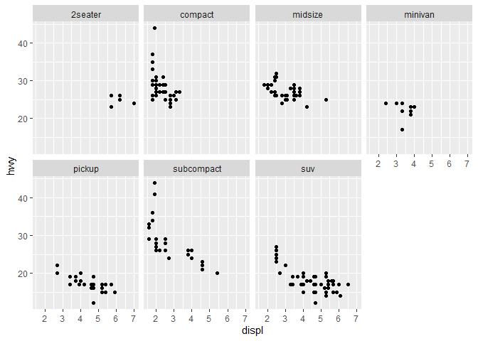
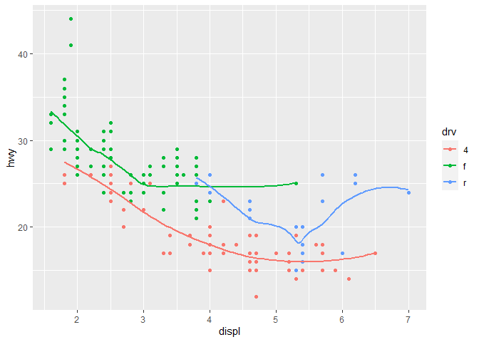

```r
ggplot(mpg)+geom_point(mapping=aes(x=displ,y=hwy))
```

<!-- -->

This is the original graph followed by the instruction of R4DS  

3.2.4.1  

```r
ggplot(data = mpg)
```

<!-- -->

This is quite strange because I cannot see anything.  
Do I make a mistake? Or just type mpg?  

```r
mpg
```

```
## # A tibble: 234 x 11
##    manufacturer model    displ  year   cyl trans   drv     cty   hwy fl    class
##    <chr>        <chr>    <dbl> <int> <int> <chr>   <chr> <int> <int> <chr> <chr>
##  1 audi         a4         1.8  1999     4 auto(l~ f        18    29 p     comp~
##  2 audi         a4         1.8  1999     4 manual~ f        21    29 p     comp~
##  3 audi         a4         2    2008     4 manual~ f        20    31 p     comp~
##  4 audi         a4         2    2008     4 auto(a~ f        21    30 p     comp~
##  5 audi         a4         2.8  1999     6 auto(l~ f        16    26 p     comp~
##  6 audi         a4         2.8  1999     6 manual~ f        18    26 p     comp~
##  7 audi         a4         3.1  2008     6 auto(a~ f        18    27 p     comp~
##  8 audi         a4 quat~   1.8  1999     4 manual~ 4        18    26 p     comp~
##  9 audi         a4 quat~   1.8  1999     4 auto(l~ 4        16    25 p     comp~
## 10 audi         a4 quat~   2    2008     4 manual~ 4        20    28 p     comp~
## # ... with 224 more rows
```

3.2.5.2:  
This chart has 234 rows and 11 columns.  

3.2.5.3:  
drv: the type of drive train (category variable and not discrete)  

3.2.5.4:  

```r
ggplot(mpg)+geom_point(mapping=aes(x=cyl,y=hwy))
```

<!-- -->

3.2.5.5:  

```r
ggplot(mpg)+geom_point(mapping=aes(x=drv,y=class))
```

<!-- -->

I think there is no meaning to give the y-axis with discrete category.  

3.3.1.1:  
ggplot(data = mpg) + 
  geom_point(mapping = aes(x = displ, y = hwy, color = "blue"))  
This code include the "color = "blue"" inside the bracket of "aes=()".  

3.3.1.2:  
The variable "manufacturer", "model", "year", "cyl", "trans", "drv", "fl", "class" are categorical.  
The variable "displ", "cty", "hwy" are continuous.  

3.3.1.3:  

```r
ggplot(mpg)+geom_point(mapping=aes(x=displ,y=hwy, color=cty))
```

<!-- -->

```r
ggplot(mpg)+geom_point(mapping=aes(x=displ,y=hwy, size=cty))
```

<!-- -->

These two work great, but I do not think I am sensitive enough to tell the delicate difference between darkness and width by my nake eyes. (They can be awful with mono-color printing.)  

No shape for continuity!  

3.3.1.4:  

```r
ggplot(mpg)+geom_point(mapping=aes(x=displ,y=hwy, size=cty, color=cty))
```

<!-- -->

This is pretty and easier to tell by my nake eyes. 

3.3.1.5:  

```r
ggplot(mpg)+geom_point(mapping=aes(x=displ,y=hwy, size=cty, stroke=3))
```

<!-- -->

Sorry it is hard for me to tell the border width modification, but WOW!  

3.3.1.6:  

```r
ggplot(mpg)+geom_point(mapping=aes(x=displ,y=hwy, size=cty, color=displ<5))
```

<!-- -->

3.5.1.1:  
We may have too many graphs with too few spots on each graph. It is harder for comparison.  

3.5.1.2:  

```r
ggplot(data=mpg)+geom_point(mapping=aes(x=displ, y=hwy))+facet_grid(drv~cyl)
```

<!-- -->

The empty cell means that there is no data fits the specific combination of variables.  

```r
ggplot(data = mpg) + 
  geom_point(mapping = aes(x = drv, y = cyl))
```

<!-- -->

The empty cell stands for the absence of spot refering to specific combination on the second graph.  

3.5.1.3:  

```r
ggplot(data = mpg) + 
  geom_point(mapping = aes(x = displ, y = hwy)) +
  facet_grid(drv ~ .)
```

<!-- -->

```r
ggplot(data = mpg) + 
  geom_point(mapping = aes(x = displ, y = hwy)) +
  facet_grid(. ~ cyl)
```

<!-- -->

The "." should stand for no more separation in which axis, "." at first is no x-axis separation (row only) and at last is no y-axis separation (column only).  

3.5.1.4:  

```r
ggplot(data = mpg) + 
  geom_point(mapping = aes(x = displ, y = hwy)) + 
  facet_wrap(~ class, nrow = 2)
```

<!-- -->

This dimension helps to separate data from different "categories" to improve intra-class analysis.  
However, it may be difficult for inter-class overall analysis, and too many graphs.  
It is hard to tell the balance, just depending on what I am dealing with and what I want. 

3.5.1.5:  
They are the number of rows and number of columns.  
To change the panel, it is to change the levels of the underlying factor, (but I don't know how to practice.)  

3.5.1.6:  
It helps to give separate analysis from different categories and sacrifices the easy access to inter-categorical analysis. No Continuous For Column Level.  

3.6.1.1:  
It should be boxplot which is the only one presented by line.  

3.6.1.2:  

```r
ggplot(data = mpg, mapping = aes(x = displ, y = hwy, color = drv)) + 
  geom_point() + 
  geom_smooth(se = FALSE)
```

```
## `geom_smooth()` using method = 'loess' and formula 'y ~ x'
```

<!-- -->

The data from different categories are separated and three different lines are given to each categories. All plots to the same categories have the same color.  

3.6.1.3:  

```r
ggplot(data = mpg) +
  geom_smooth(
    mapping = aes(x = displ, y = hwy, color = drv),
    show.legend = FALSE)
```

```
## `geom_smooth()` using method = 'loess' and formula 'y ~ x'
```

<!-- -->

```r
ggplot(data = mpg) +
  geom_smooth(
    mapping = aes(x = displ, y = hwy, color = drv)
  )
```

```
## `geom_smooth()` using method = 'loess' and formula 'y ~ x'
```

<!-- -->

The code "show. legend=FALSE" tends to hide the legends form side plots.  
There will be legends shown on the side.  
Sorry I do not know why you used it earlier.  

3.6.1.4:  
The "se" should indicate the confidence interval of the data.  

3.6.1.5:  

```r
ggplot(data = mpg, mapping = aes(x = displ, y = hwy)) + 
  geom_point() + 
  geom_smooth()
```

```
## `geom_smooth()` using method = 'loess' and formula 'y ~ x'
```

<!-- -->

```r
ggplot() + 
  geom_point(data = mpg, mapping = aes(x = displ, y = hwy)) + 
  geom_smooth(data = mpg, mapping = aes(x = displ, y = hwy))
```

```
## `geom_smooth()` using method = 'loess' and formula 'y ~ x'
```

<!-- -->

These two codes direct the same graphs, because for point and smooth plots, they all have the same elements "mapping = aes(x = displ, y = hwy)".  

3.6.1.6:  
For graph 4

```r
ggplot()+
  geom_point(data=mpg, mapping = aes(x=displ, y=hwy, color=drv), , stroke =3, show.legend = TRUE)+ geom_smooth(data=mpg, mapping = aes(x=displ, y=hwy), color="blue", se=FALSE)
```

```
## `geom_smooth()` using method = 'loess' and formula 'y ~ x'
```

<!-- -->

