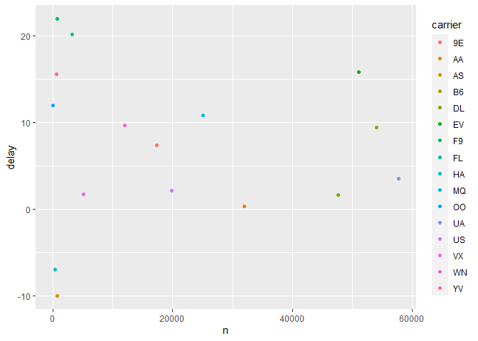
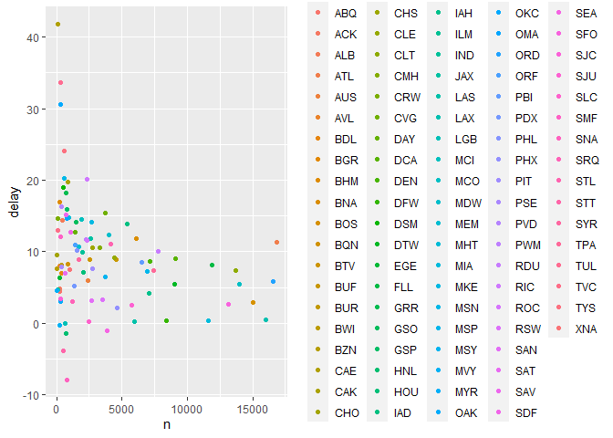

4.4.1:  
The name we have given a value is "my_variable", but the code I type to get the value is "my_varıable" which is "ı" instead of "i", (but how to type "ı"?).  

4.4.2:  

```r
library(tidyverse)
ggplot(data=mpg)+geom_point(mapping=aes(x=displ, y=hwy))
```

<!-- -->

```r
filter(mpg, cyl==8)
```

```
## # A tibble: 70 x 11
##    manufacturer model     displ  year   cyl trans  drv     cty   hwy fl    class
##    <chr>        <chr>     <dbl> <int> <int> <chr>  <chr> <int> <int> <chr> <chr>
##  1 audi         a6 quatt~   4.2  2008     8 auto(~ 4        16    23 p     mids~
##  2 chevrolet    c1500 su~   5.3  2008     8 auto(~ r        14    20 r     suv  
##  3 chevrolet    c1500 su~   5.3  2008     8 auto(~ r        11    15 e     suv  
##  4 chevrolet    c1500 su~   5.3  2008     8 auto(~ r        14    20 r     suv  
##  5 chevrolet    c1500 su~   5.7  1999     8 auto(~ r        13    17 r     suv  
##  6 chevrolet    c1500 su~   6    2008     8 auto(~ r        12    17 r     suv  
##  7 chevrolet    corvette    5.7  1999     8 manua~ r        16    26 p     2sea~
##  8 chevrolet    corvette    5.7  1999     8 auto(~ r        15    23 p     2sea~
##  9 chevrolet    corvette    6.2  2008     8 manua~ r        16    26 p     2sea~
## 10 chevrolet    corvette    6.2  2008     8 auto(~ r        15    25 p     2sea~
## # ... with 60 more rows
```

```r
filter(diamonds, carat>3)
```

```
## # A tibble: 32 x 10
##    carat cut     color clarity depth table price     x     y     z
##    <dbl> <ord>   <ord> <ord>   <dbl> <dbl> <int> <dbl> <dbl> <dbl>
##  1  3.01 Premium I     I1       62.7    58  8040  9.1   8.97  5.67
##  2  3.11 Fair    J     I1       65.9    57  9823  9.15  9.02  5.98
##  3  3.01 Premium F     I1       62.2    56  9925  9.24  9.13  5.73
##  4  3.05 Premium E     I1       60.9    58 10453  9.26  9.25  5.66
##  5  3.02 Fair    I     I1       65.2    56 10577  9.11  9.02  5.91
##  6  3.01 Fair    H     I1       56.1    62 10761  9.54  9.38  5.31
##  7  3.65 Fair    H     I1       67.1    53 11668  9.53  9.48  6.38
##  8  3.24 Premium H     I1       62.1    58 12300  9.44  9.4   5.85
##  9  3.22 Ideal   I     I1       62.6    55 12545  9.49  9.42  5.92
## 10  3.5  Ideal   H     I1       62.8    57 12587  9.65  9.59  6.03
## # ... with 22 more rows
```

This is really tricky. The second code mistakes the "data" to "dota". The third code mistakes the "filter" to "fliter" and misses one "=". THe forth code misses "s" attached to the data name"diamaonds" and there are no dataset called "diamond".  

4.4.3:  
This tells the use of different shortcut key combination. It is quite useful. 

5.2.4.1:  

```r
filter(flights, arr_delay>=2)
```

```
## # A tibble: 127,929 x 19
##     year month   day dep_time sched_dep_time dep_delay arr_time sched_arr_time
##    <int> <int> <int>    <int>          <int>     <dbl>    <int>          <int>
##  1  2013     1     1      517            515         2      830            819
##  2  2013     1     1      533            529         4      850            830
##  3  2013     1     1      542            540         2      923            850
##  4  2013     1     1      554            558        -4      740            728
##  5  2013     1     1      555            600        -5      913            854
##  6  2013     1     1      558            600        -2      753            745
##  7  2013     1     1      558            600        -2      924            917
##  8  2013     1     1      559            600        -1      941            910
##  9  2013     1     1      600            600         0      837            825
## 10  2013     1     1      602            605        -3      821            805
## # ... with 127,919 more rows, and 11 more variables: arr_delay <dbl>,
## #   carrier <chr>, flight <int>, tailnum <chr>, origin <chr>, dest <chr>,
## #   air_time <dbl>, distance <dbl>, hour <dbl>, minute <dbl>, time_hour <dttm>
```

```r
filter(flights, month==7|month==8|month==9)
```

```
## # A tibble: 86,326 x 19
##     year month   day dep_time sched_dep_time dep_delay arr_time sched_arr_time
##    <int> <int> <int>    <int>          <int>     <dbl>    <int>          <int>
##  1  2013     7     1        1           2029       212      236           2359
##  2  2013     7     1        2           2359         3      344            344
##  3  2013     7     1       29           2245       104      151              1
##  4  2013     7     1       43           2130       193      322             14
##  5  2013     7     1       44           2150       174      300            100
##  6  2013     7     1       46           2051       235      304           2358
##  7  2013     7     1       48           2001       287      308           2305
##  8  2013     7     1       58           2155       183      335             43
##  9  2013     7     1      100           2146       194      327             30
## 10  2013     7     1      100           2245       135      337            135
## # ... with 86,316 more rows, and 11 more variables: arr_delay <dbl>,
## #   carrier <chr>, flight <int>, tailnum <chr>, origin <chr>, dest <chr>,
## #   air_time <dbl>, distance <dbl>, hour <dbl>, minute <dbl>, time_hour <dttm>
```

```r
filter(flights, arr_delay>=2 & dep_delay==0)
```

```
## # A tibble: 4,694 x 19
##     year month   day dep_time sched_dep_time dep_delay arr_time sched_arr_time
##    <int> <int> <int>    <int>          <int>     <dbl>    <int>          <int>
##  1  2013     1     1      600            600         0      837            825
##  2  2013     1     1      635            635         0     1028            940
##  3  2013     1     1      739            739         0     1104           1038
##  4  2013     1     1      745            745         0     1135           1125
##  5  2013     1     1      800            800         0     1022           1014
##  6  2013     1     1      805            805         0     1015           1005
##  7  2013     1     1      810            810         0     1048           1037
##  8  2013     1     1      823            823         0     1151           1135
##  9  2013     1     1      830            830         0     1018           1015
## 10  2013     1     1      835            835         0     1210           1150
## # ... with 4,684 more rows, and 11 more variables: arr_delay <dbl>,
## #   carrier <chr>, flight <int>, tailnum <chr>, origin <chr>, dest <chr>,
## #   air_time <dbl>, distance <dbl>, hour <dbl>, minute <dbl>, time_hour <dttm>
```

```r
filter(flights, (dep_time>0 & dep_time<=600) | dep_time==2400)
```

```
## # A tibble: 9,373 x 19
##     year month   day dep_time sched_dep_time dep_delay arr_time sched_arr_time
##    <int> <int> <int>    <int>          <int>     <dbl>    <int>          <int>
##  1  2013     1     1      517            515         2      830            819
##  2  2013     1     1      533            529         4      850            830
##  3  2013     1     1      542            540         2      923            850
##  4  2013     1     1      544            545        -1     1004           1022
##  5  2013     1     1      554            600        -6      812            837
##  6  2013     1     1      554            558        -4      740            728
##  7  2013     1     1      555            600        -5      913            854
##  8  2013     1     1      557            600        -3      709            723
##  9  2013     1     1      557            600        -3      838            846
## 10  2013     1     1      558            600        -2      753            745
## # ... with 9,363 more rows, and 11 more variables: arr_delay <dbl>,
## #   carrier <chr>, flight <int>, tailnum <chr>, origin <chr>, dest <chr>,
## #   air_time <dbl>, distance <dbl>, hour <dbl>, minute <dbl>, time_hour <dttm>
```

5.2.4.2:  

```r
filter(flights, between(month,7,9))
```

```
## # A tibble: 86,326 x 19
##     year month   day dep_time sched_dep_time dep_delay arr_time sched_arr_time
##    <int> <int> <int>    <int>          <int>     <dbl>    <int>          <int>
##  1  2013     7     1        1           2029       212      236           2359
##  2  2013     7     1        2           2359         3      344            344
##  3  2013     7     1       29           2245       104      151              1
##  4  2013     7     1       43           2130       193      322             14
##  5  2013     7     1       44           2150       174      300            100
##  6  2013     7     1       46           2051       235      304           2358
##  7  2013     7     1       48           2001       287      308           2305
##  8  2013     7     1       58           2155       183      335             43
##  9  2013     7     1      100           2146       194      327             30
## 10  2013     7     1      100           2245       135      337            135
## # ... with 86,316 more rows, and 11 more variables: arr_delay <dbl>,
## #   carrier <chr>, flight <int>, tailnum <chr>, origin <chr>, dest <chr>,
## #   air_time <dbl>, distance <dbl>, hour <dbl>, minute <dbl>, time_hour <dttm>
```

```r
filter(flights, between(dep_time,0,600)|dep_time==2400)
```

```
## # A tibble: 9,373 x 19
##     year month   day dep_time sched_dep_time dep_delay arr_time sched_arr_time
##    <int> <int> <int>    <int>          <int>     <dbl>    <int>          <int>
##  1  2013     1     1      517            515         2      830            819
##  2  2013     1     1      533            529         4      850            830
##  3  2013     1     1      542            540         2      923            850
##  4  2013     1     1      544            545        -1     1004           1022
##  5  2013     1     1      554            600        -6      812            837
##  6  2013     1     1      554            558        -4      740            728
##  7  2013     1     1      555            600        -5      913            854
##  8  2013     1     1      557            600        -3      709            723
##  9  2013     1     1      557            600        -3      838            846
## 10  2013     1     1      558            600        -2      753            745
## # ... with 9,363 more rows, and 11 more variables: arr_delay <dbl>,
## #   carrier <chr>, flight <int>, tailnum <chr>, origin <chr>, dest <chr>,
## #   air_time <dbl>, distance <dbl>, hour <dbl>, minute <dbl>, time_hour <dttm>
```

Only the code for 2 and 4 can be modified by "between". 

5.2.4.3:  

```r
filter(flights, is.na(dep_time))
```

```
## # A tibble: 8,255 x 19
##     year month   day dep_time sched_dep_time dep_delay arr_time sched_arr_time
##    <int> <int> <int>    <int>          <int>     <dbl>    <int>          <int>
##  1  2013     1     1       NA           1630        NA       NA           1815
##  2  2013     1     1       NA           1935        NA       NA           2240
##  3  2013     1     1       NA           1500        NA       NA           1825
##  4  2013     1     1       NA            600        NA       NA            901
##  5  2013     1     2       NA           1540        NA       NA           1747
##  6  2013     1     2       NA           1620        NA       NA           1746
##  7  2013     1     2       NA           1355        NA       NA           1459
##  8  2013     1     2       NA           1420        NA       NA           1644
##  9  2013     1     2       NA           1321        NA       NA           1536
## 10  2013     1     2       NA           1545        NA       NA           1910
## # ... with 8,245 more rows, and 11 more variables: arr_delay <dbl>,
## #   carrier <chr>, flight <int>, tailnum <chr>, origin <chr>, dest <chr>,
## #   air_time <dbl>, distance <dbl>, hour <dbl>, minute <dbl>, time_hour <dttm>
```

These flights should be cancelled ones due to lack of numerous variables on one row. 

5.3.1.1:  

```r
arrange(flights, desc(is.na(dep_time)))
```

```
## # A tibble: 336,776 x 19
##     year month   day dep_time sched_dep_time dep_delay arr_time sched_arr_time
##    <int> <int> <int>    <int>          <int>     <dbl>    <int>          <int>
##  1  2013     1     1       NA           1630        NA       NA           1815
##  2  2013     1     1       NA           1935        NA       NA           2240
##  3  2013     1     1       NA           1500        NA       NA           1825
##  4  2013     1     1       NA            600        NA       NA            901
##  5  2013     1     2       NA           1540        NA       NA           1747
##  6  2013     1     2       NA           1620        NA       NA           1746
##  7  2013     1     2       NA           1355        NA       NA           1459
##  8  2013     1     2       NA           1420        NA       NA           1644
##  9  2013     1     2       NA           1321        NA       NA           1536
## 10  2013     1     2       NA           1545        NA       NA           1910
## # ... with 336,766 more rows, and 11 more variables: arr_delay <dbl>,
## #   carrier <chr>, flight <int>, tailnum <chr>, origin <chr>, dest <chr>,
## #   air_time <dbl>, distance <dbl>, hour <dbl>, minute <dbl>, time_hour <dttm>
```

5.3.1.2:  

```r
arrange(flights, desc(dep_delay))
```

```
## # A tibble: 336,776 x 19
##     year month   day dep_time sched_dep_time dep_delay arr_time sched_arr_time
##    <int> <int> <int>    <int>          <int>     <dbl>    <int>          <int>
##  1  2013     1     9      641            900      1301     1242           1530
##  2  2013     6    15     1432           1935      1137     1607           2120
##  3  2013     1    10     1121           1635      1126     1239           1810
##  4  2013     9    20     1139           1845      1014     1457           2210
##  5  2013     7    22      845           1600      1005     1044           1815
##  6  2013     4    10     1100           1900       960     1342           2211
##  7  2013     3    17     2321            810       911      135           1020
##  8  2013     6    27      959           1900       899     1236           2226
##  9  2013     7    22     2257            759       898      121           1026
## 10  2013    12     5      756           1700       896     1058           2020
## # ... with 336,766 more rows, and 11 more variables: arr_delay <dbl>,
## #   carrier <chr>, flight <int>, tailnum <chr>, origin <chr>, dest <chr>,
## #   air_time <dbl>, distance <dbl>, hour <dbl>, minute <dbl>, time_hour <dttm>
```

```r
arrange(flights, dep_delay)
```

```
## # A tibble: 336,776 x 19
##     year month   day dep_time sched_dep_time dep_delay arr_time sched_arr_time
##    <int> <int> <int>    <int>          <int>     <dbl>    <int>          <int>
##  1  2013    12     7     2040           2123       -43       40           2352
##  2  2013     2     3     2022           2055       -33     2240           2338
##  3  2013    11    10     1408           1440       -32     1549           1559
##  4  2013     1    11     1900           1930       -30     2233           2243
##  5  2013     1    29     1703           1730       -27     1947           1957
##  6  2013     8     9      729            755       -26     1002            955
##  7  2013    10    23     1907           1932       -25     2143           2143
##  8  2013     3    30     2030           2055       -25     2213           2250
##  9  2013     3     2     1431           1455       -24     1601           1631
## 10  2013     5     5      934            958       -24     1225           1309
## # ... with 336,766 more rows, and 11 more variables: arr_delay <dbl>,
## #   carrier <chr>, flight <int>, tailnum <chr>, origin <chr>, dest <chr>,
## #   air_time <dbl>, distance <dbl>, hour <dbl>, minute <dbl>, time_hour <dttm>
```

5.3.1.3:  
I do not know how to accomplish it with arrange only. 

5.3.1.4:  

```r
arrange(flights, distance)
```

```
## # A tibble: 336,776 x 19
##     year month   day dep_time sched_dep_time dep_delay arr_time sched_arr_time
##    <int> <int> <int>    <int>          <int>     <dbl>    <int>          <int>
##  1  2013     7    27       NA            106        NA       NA            245
##  2  2013     1     3     2127           2129        -2     2222           2224
##  3  2013     1     4     1240           1200        40     1333           1306
##  4  2013     1     4     1829           1615       134     1937           1721
##  5  2013     1     4     2128           2129        -1     2218           2224
##  6  2013     1     5     1155           1200        -5     1241           1306
##  7  2013     1     6     2125           2129        -4     2224           2224
##  8  2013     1     7     2124           2129        -5     2212           2224
##  9  2013     1     8     2127           2130        -3     2304           2225
## 10  2013     1     9     2126           2129        -3     2217           2224
## # ... with 336,766 more rows, and 11 more variables: arr_delay <dbl>,
## #   carrier <chr>, flight <int>, tailnum <chr>, origin <chr>, dest <chr>,
## #   air_time <dbl>, distance <dbl>, hour <dbl>, minute <dbl>, time_hour <dttm>
```

```r
arrange(flights, desc(distance))
```

```
## # A tibble: 336,776 x 19
##     year month   day dep_time sched_dep_time dep_delay arr_time sched_arr_time
##    <int> <int> <int>    <int>          <int>     <dbl>    <int>          <int>
##  1  2013     1     1      857            900        -3     1516           1530
##  2  2013     1     2      909            900         9     1525           1530
##  3  2013     1     3      914            900        14     1504           1530
##  4  2013     1     4      900            900         0     1516           1530
##  5  2013     1     5      858            900        -2     1519           1530
##  6  2013     1     6     1019            900        79     1558           1530
##  7  2013     1     7     1042            900       102     1620           1530
##  8  2013     1     8      901            900         1     1504           1530
##  9  2013     1     9      641            900      1301     1242           1530
## 10  2013     1    10      859            900        -1     1449           1530
## # ... with 336,766 more rows, and 11 more variables: arr_delay <dbl>,
## #   carrier <chr>, flight <int>, tailnum <chr>, origin <chr>, dest <chr>,
## #   air_time <dbl>, distance <dbl>, hour <dbl>, minute <dbl>, time_hour <dttm>
```

The first chart can help to find the shortest and the second one can help to find the farthest.  
5.4.1.1:  

```r
select(flights, dep_time,dep_delay:arr_time,arr_delay)
```

```
## # A tibble: 336,776 x 4
##    dep_time dep_delay arr_time arr_delay
##       <int>     <dbl>    <int>     <dbl>
##  1      517         2      830        11
##  2      533         4      850        20
##  3      542         2      923        33
##  4      544        -1     1004       -18
##  5      554        -6      812       -25
##  6      554        -4      740        12
##  7      555        -5      913        19
##  8      557        -3      709       -14
##  9      557        -3      838        -8
## 10      558        -2      753         8
## # ... with 336,766 more rows
```

```r
select(flights, dep_time, dep_delay,arr_time,arr_delay)
```

```
## # A tibble: 336,776 x 4
##    dep_time dep_delay arr_time arr_delay
##       <int>     <dbl>    <int>     <dbl>
##  1      517         2      830        11
##  2      533         4      850        20
##  3      542         2      923        33
##  4      544        -1     1004       -18
##  5      554        -6      812       -25
##  6      554        -4      740        12
##  7      555        -5      913        19
##  8      557        -3      709       -14
##  9      557        -3      838        -8
## 10      558        -2      753         8
## # ... with 336,766 more rows
```

```r
select(flights, starts_with("dep_"),starts_with("arr_"))
```

```
## # A tibble: 336,776 x 4
##    dep_time dep_delay arr_time arr_delay
##       <int>     <dbl>    <int>     <dbl>
##  1      517         2      830        11
##  2      533         4      850        20
##  3      542         2      923        33
##  4      544        -1     1004       -18
##  5      554        -6      812       -25
##  6      554        -4      740        12
##  7      555        -5      913        19
##  8      557        -3      709       -14
##  9      557        -3      838        -8
## 10      558        -2      753         8
## # ... with 336,766 more rows
```

```r
select(flights, contains("arr"),contains("dep"),-contains("sched"), -carrier)
```

```
## # A tibble: 336,776 x 4
##    arr_time arr_delay dep_time dep_delay
##       <int>     <dbl>    <int>     <dbl>
##  1      830        11      517         2
##  2      850        20      533         4
##  3      923        33      542         2
##  4     1004       -18      544        -1
##  5      812       -25      554        -6
##  6      740        12      554        -4
##  7      913        19      555        -5
##  8      709       -14      557        -3
##  9      838        -8      557        -3
## 10      753         8      558        -2
## # ... with 336,766 more rows
```

5.4.1.2: 

```r
select(flights, year,year,month,day)
```

```
## # A tibble: 336,776 x 3
##     year month   day
##    <int> <int> <int>
##  1  2013     1     1
##  2  2013     1     1
##  3  2013     1     1
##  4  2013     1     1
##  5  2013     1     1
##  6  2013     1     1
##  7  2013     1     1
##  8  2013     1     1
##  9  2013     1     1
## 10  2013     1     1
## # ... with 336,766 more rows
```

nothing happens. Why can you be so smart here??  

5.4.1.3:  

```r
vars <- c("year", "month", "day", "dep_delay", "arr_delay")
select(flights,one_of(vars))
```

```
## # A tibble: 336,776 x 5
##     year month   day dep_delay arr_delay
##    <int> <int> <int>     <dbl>     <dbl>
##  1  2013     1     1         2        11
##  2  2013     1     1         4        20
##  3  2013     1     1         2        33
##  4  2013     1     1        -1       -18
##  5  2013     1     1        -6       -25
##  6  2013     1     1        -4        12
##  7  2013     1     1        -5        19
##  8  2013     1     1        -3       -14
##  9  2013     1     1        -3        -8
## 10  2013     1     1        -2         8
## # ... with 336,766 more rows
```

This function helps to show all variables in the vector.  

5.4.1.4:  

```r
select(flights, contains("TIME"))
```

```
## # A tibble: 336,776 x 6
##    dep_time sched_dep_time arr_time sched_arr_time air_time time_hour          
##       <int>          <int>    <int>          <int>    <dbl> <dttm>             
##  1      517            515      830            819      227 2013-01-01 05:00:00
##  2      533            529      850            830      227 2013-01-01 05:00:00
##  3      542            540      923            850      160 2013-01-01 05:00:00
##  4      544            545     1004           1022      183 2013-01-01 05:00:00
##  5      554            600      812            837      116 2013-01-01 06:00:00
##  6      554            558      740            728      150 2013-01-01 05:00:00
##  7      555            600      913            854      158 2013-01-01 06:00:00
##  8      557            600      709            723       53 2013-01-01 06:00:00
##  9      557            600      838            846      140 2013-01-01 06:00:00
## 10      558            600      753            745      138 2013-01-01 06:00:00
## # ... with 336,766 more rows
```

5.5.2.1:  

```r
transmute(flights, dep_time, dep_time_minute=(dep_time%/%100)*60+dep_time%%100, sched_dep_time, sched_dep_time_minute=(sched_dep_time%/%100)*60+sched_dep_time%%100)
```

```
## # A tibble: 336,776 x 4
##    dep_time dep_time_minute sched_dep_time sched_dep_time_minute
##       <int>           <dbl>          <int>                 <dbl>
##  1      517             317            515                   315
##  2      533             333            529                   329
##  3      542             342            540                   340
##  4      544             344            545                   345
##  5      554             354            600                   360
##  6      554             354            558                   358
##  7      555             355            600                   360
##  8      557             357            600                   360
##  9      557             357            600                   360
## 10      558             358            600                   360
## # ... with 336,766 more rows
```

5.5.2.2:  

```r
transmute(flights, air_time, time=arr_time-dep_time)
```

```
## # A tibble: 336,776 x 2
##    air_time  time
##       <dbl> <int>
##  1      227   313
##  2      227   317
##  3      160   381
##  4      183   460
##  5      116   258
##  6      150   186
##  7      158   358
##  8       53   152
##  9      140   281
## 10      138   195
## # ... with 336,766 more rows
```

The time for "arr_time"-"dep_time" becomes very strange because the "air_time" is counting the minutes in the air while "arr_time" and "dep_time" have the other format of "hour-minute" whose direct calculation can lead to a mess. 

5.5.2.3:  

```r
select(flights, dep_time, sched_dep_time, dep_delay)
```

```
## # A tibble: 336,776 x 3
##    dep_time sched_dep_time dep_delay
##       <int>          <int>     <dbl>
##  1      517            515         2
##  2      533            529         4
##  3      542            540         2
##  4      544            545        -1
##  5      554            600        -6
##  6      554            558        -4
##  7      555            600        -5
##  8      557            600        -3
##  9      557            600        -3
## 10      558            600        -2
## # ... with 336,766 more rows
```

dep_delay=dep_time-sched_dep_time

5.5.2.4:  

```r
arrange(flights, desc(dep_delay))
```

```
## # A tibble: 336,776 x 19
##     year month   day dep_time sched_dep_time dep_delay arr_time sched_arr_time
##    <int> <int> <int>    <int>          <int>     <dbl>    <int>          <int>
##  1  2013     1     9      641            900      1301     1242           1530
##  2  2013     6    15     1432           1935      1137     1607           2120
##  3  2013     1    10     1121           1635      1126     1239           1810
##  4  2013     9    20     1139           1845      1014     1457           2210
##  5  2013     7    22      845           1600      1005     1044           1815
##  6  2013     4    10     1100           1900       960     1342           2211
##  7  2013     3    17     2321            810       911      135           1020
##  8  2013     6    27      959           1900       899     1236           2226
##  9  2013     7    22     2257            759       898      121           1026
## 10  2013    12     5      756           1700       896     1058           2020
## # ... with 336,766 more rows, and 11 more variables: arr_delay <dbl>,
## #   carrier <chr>, flight <int>, tailnum <chr>, origin <chr>, dest <chr>,
## #   air_time <dbl>, distance <dbl>, hour <dbl>, minute <dbl>, time_hour <dttm>
```

I do not know how to use the function "mid_rank()" but I think I can get the same consequence by the "arrange()" function.  

5.5.2.5

```r
1:3+1:10
```

```
## Warning in 1:3 + 1:10: 长的对象长度不是短的对象长度的整倍数
```

```
##  [1]  2  4  6  5  7  9  8 10 12 11
```

The error code??  

5.6.7.5:  

```r
not_cancelled<-flights %>%
  filter(!is.na(dep_delay),!is.na(arr_delay))
delays<-not_cancelled%>%
  group_by(carrier)%>%
  summarise(n=n(),delay=mean(arr_delay, na.rm = TRUE))%>%
  filter(n>=25)
ggplot(data=delays, mapping = aes(x=n, y=delay, color=carrier))+geom_point()
```

<!-- -->

```r
delays<-not_cancelled%>%
  group_by(dest)%>%
  summarise(n=n(),delay=mean(arr_delay, na.rm = TRUE))%>%
  filter(n>=25)
ggplot(data=delays, mapping = aes(x=n, y=delay, color=dest))+geom_point()
```

<!-- -->

I get that the carrier F9 should have the worst delay. 
