## 7.3.4.1:  
## Explore the distribution of each of the x, y, and z variables in diamonds. What do you learn? Think about a diamond and how you might decide which dimension is the length, width, and depth.

```r
ggplot(data=diamonds)+
  geom_histogram(mapping = aes(x=x), binwidth = 0.1)
```

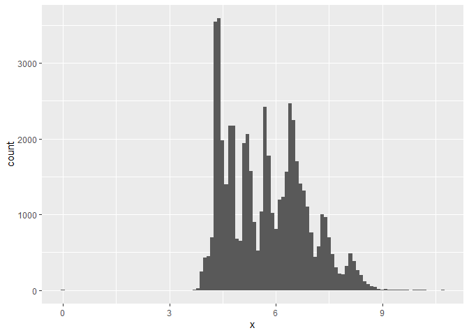<!-- -->

```r
ggplot(data=diamonds)+
  geom_histogram(mapping = aes(x=y), binwidth = 0.1)
```

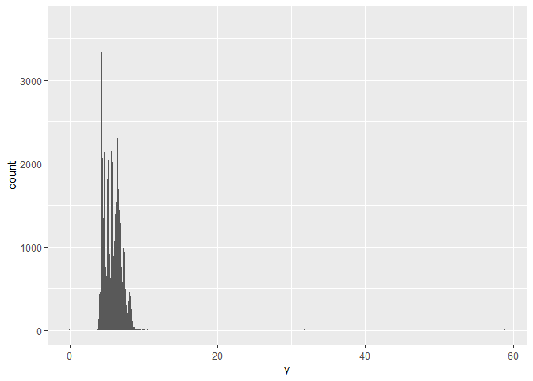<!-- -->

```r
ggplot(data=diamonds)+
  geom_histogram(mapping = aes(x=z), binwidth = 0.1)
```

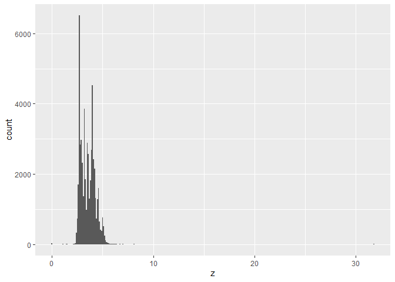<!-- -->

###These diagrams show range of distribution is different: "x" is the largest and "z"is the smallest, so "x" is the length, "y" is the width, "z" is the depth.  

##7.3.4.2:  
##Explore the distribution of price. Do you discover anything unusual or surprising? (Hint: Carefully think about the binwidth and make sure you try a wide range of values.)

```r
ggplot(data=diamonds, mapping=aes(x=price))+
  geom_histogram(binwidth=200)
```

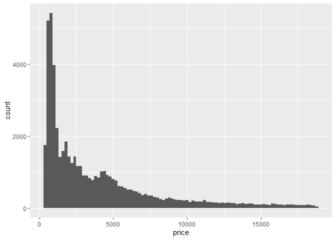<!-- -->

### Why this distribution is quite similar to a hyperbola?  

## 7.3.4.3:  
## How many diamonds are 0.99 carat? How many are 1 carat? What do you think is the cause of the difference?

```r
diamonds%>%
  count(cut_width(carat, 0.01))
```

```
## # A tibble: 273 x 2
##    `cut_width(carat, 0.01)`     n
##    <fct>                    <int>
##  1 [0.195,0.205]               12
##  2 (0.205,0.215]                9
##  3 (0.215,0.225]                5
##  4 (0.225,0.235]              293
##  5 (0.235,0.245]              254
##  6 (0.245,0.255]              212
##  7 (0.255,0.265]              253
##  8 (0.265,0.275]              233
##  9 (0.275,0.285]              198
## 10 (0.285,0.295]              130
## # ... with 263 more rows
```

### I do not really no what can be the cause. Can it be the marketing intension??  

## 7.3.4.4:  
## Compare and contrast coord_cartesian() vs xlim() or ylim() when zooming in on a histogram. What happens if you leave binwidth unset? What happens if you try and zoom so only half a bar shows?  

```r
ggplot(diamonds) + 
  geom_histogram(mapping = aes(x = y), binwidth = 0.5) +
  coord_cartesian(ylim = c(0, 50))
```

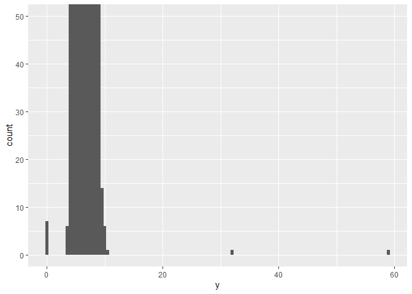<!-- -->

```r
ggplot(diamonds) + 
  geom_histogram(mapping = aes(x = y), binwidth = 0.5) +
  coord_cartesian(xlim = c(30, 60))
```

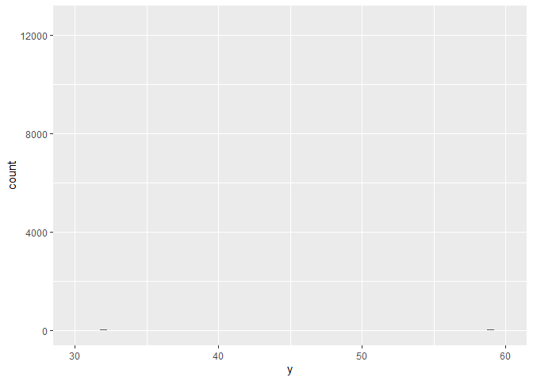<!-- -->

### It seems that the binwidth cannot be unset. However, when I try zooming in x, I cannot see the outlier value.  

## 7.4.1.1:  
##What happens to missing values in a histogram? What happens to missing values in a bar chart? Why is there a difference?  

```r
ggplot(data=diamonds, mapping=aes(x=price))+
  geom_histogram(binwidth=1500)
```

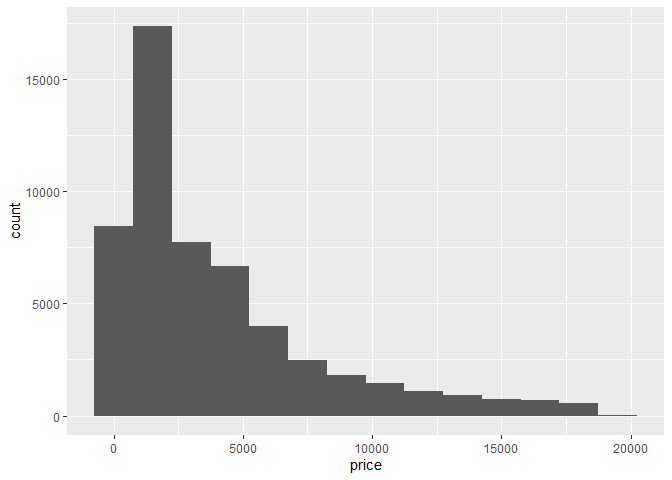<!-- -->

```r
ggplot(data=diamonds, mapping=aes(x=price))+
  geom_bar()
```

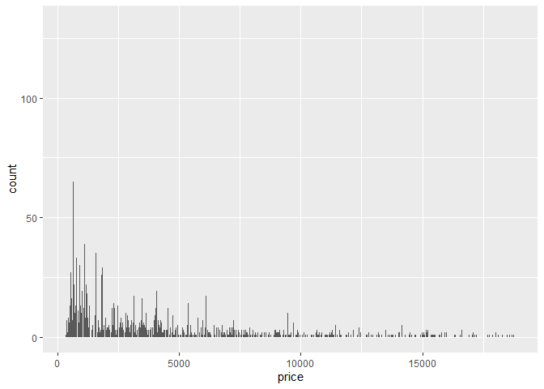<!-- -->

### Sorry, I cannot see any difference between them because both show no box when there is no value valid in such scope.  

## 7.4.1.2:  
## What does na.rm = TRUE do in mean() and sum()?  
### It seems to remove "NA" from the collection in calculation.  

## 7.5.1.1.1:  
## Use what you’ve learned to improve the visualisation of the departure times of cancelled vs. non-cancelled flights.

```r
nycflights13::flights %>% 
  mutate(
    cancelled = is.na(dep_time),
    sched_hour = sched_dep_time %/% 100,
    sched_min = sched_dep_time %% 100,
    sched_dep_time = sched_hour + sched_min / 60
  ) %>% 
  ggplot() + 
    geom_boxplot(mapping = aes(x=cancelled, y=sched_dep_time))
```

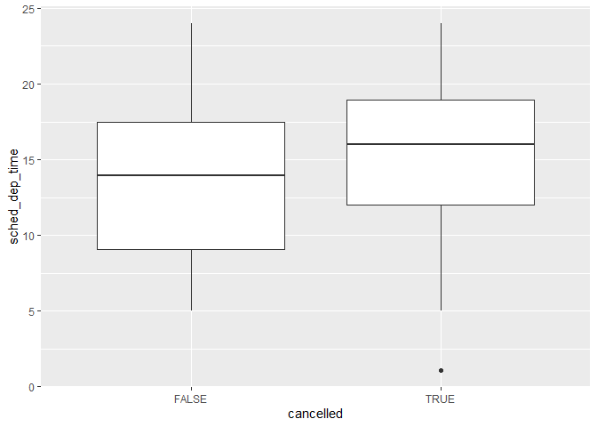<!-- -->

## 7.5.1.1.2:  

```r
ggplot(data=diamonds)+
  geom_point(mapping=aes(x=carat, y=price))+
  geom_smooth(mapping=aes(x=carat, y=price), se=TRUE)+
  facet_wrap(~cut, nrow=2)
```

```
## `geom_smooth()` using method = 'gam' and formula 'y ~ s(x, bs = "cs")'
```

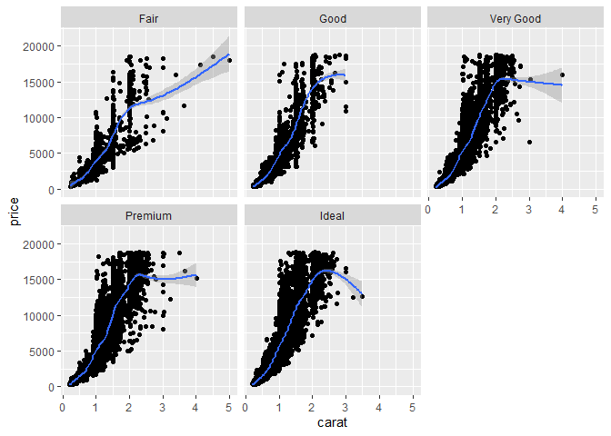<!-- -->

### The boxplot diagrams is not so obvious in this situation

## 7.5.1.1.3:  
## Install the ggstance package, and create a horizontal boxplot. How does this compare to using coord_flip()?

```r
ggplot(diamonds)+
  geom_boxplot(mapping=aes(x=cut, y=carat))+
  coord_flip()
```

<!-- -->

```r
ggplot(diamonds)+
  geom_boxploth(mapping=aes(y=cut, x=carat))
```

<!-- -->

### They seem to have no differences. 

## 7.5.1.1.5:  
## Compare and contrast geom_violin() with a facetted geom_histogram(), or a coloured geom_freqpoly(). What are the pros and cons of each method?

```r
ggplot(diamonds)+
  geom_violin(mapping=aes(x=cut, y=price))
```

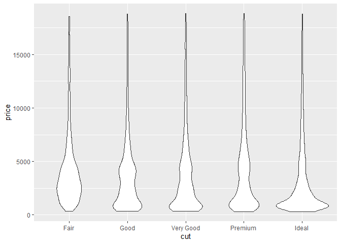<!-- -->

```r
ggplot(diamonds)+
  geom_histogram(mapping=aes(x=price))+
  facet_wrap(~cut, nrow=1)
```

```
## `stat_bin()` using `bins = 30`. Pick better value with `binwidth`.
```

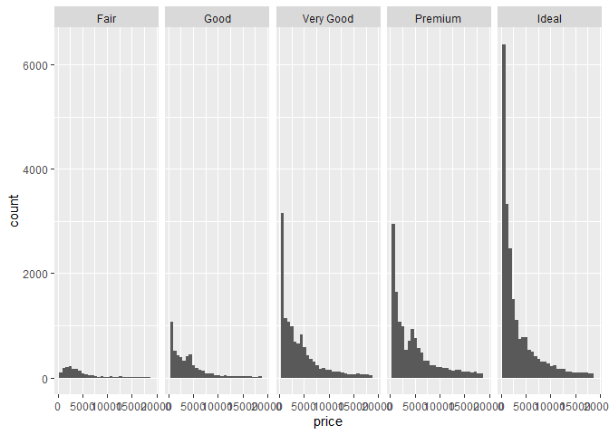<!-- -->

```r
ggplot(diamonds)+
  geom_freqpoly(mapping=aes(x=price, colour=cut))
```

```
## `stat_bin()` using `bins = 30`. Pick better value with `binwidth`.
```

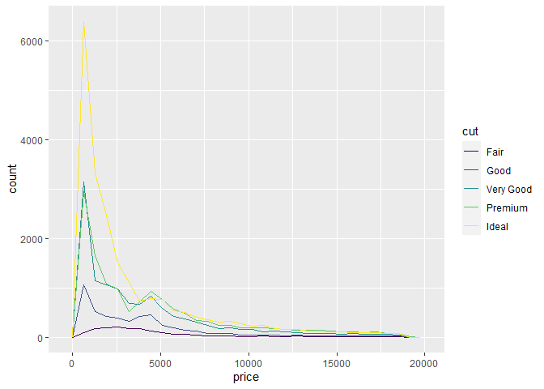<!-- -->

### The violin is quite cleae to compare between groups while the histogram and freqpoly are a bit approximate in expressing the counting.  

## 7.5.1.1.6:  
## If you have a small dataset, it’s sometimes useful to use geom_jitter() to see the relationship between a continuous and categorical variable. The ggbeeswarm package provides a number of methods similar to geom_jitter(). List them and briefly describe what each one does.

### Sorry I have no ideas!!!
