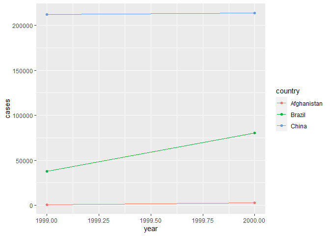
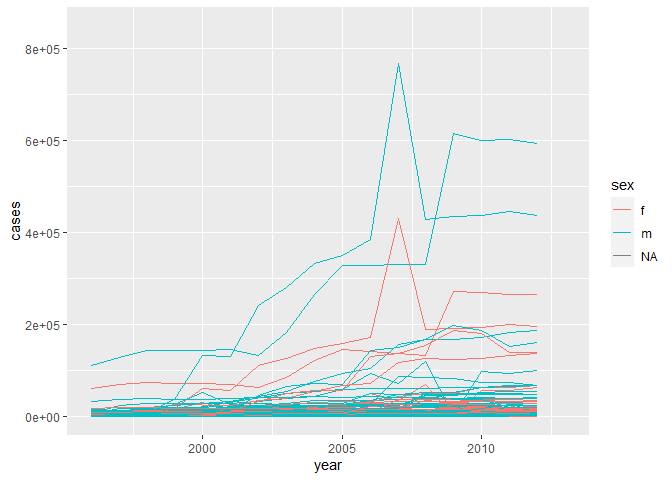

## 12.2.1.2: Compute the rate for table2, and table4a + table4b. You will need to perform four operations:

Extract the number of TB cases per country per year.  
Extract the matching population per country per year.  
Divide cases by population, and multiply by 10000.  
Store back in the appropriate place.  
Which representation is easiest to work with? Which is hardest? Why?  

```r
table2
```

```
## # A tibble: 12 x 4
##    country      year type            count
##    <chr>       <int> <chr>           <int>
##  1 Afghanistan  1999 cases             745
##  2 Afghanistan  1999 population   19987071
##  3 Afghanistan  2000 cases            2666
##  4 Afghanistan  2000 population   20595360
##  5 Brazil       1999 cases           37737
##  6 Brazil       1999 population  172006362
##  7 Brazil       2000 cases           80488
##  8 Brazil       2000 population  174504898
##  9 China        1999 cases          212258
## 10 China        1999 population 1272915272
## 11 China        2000 cases          213766
## 12 China        2000 population 1280428583
```

```r
#> # A tibble: 12 x 4
#>   country      year type           count
#>   <chr>       <int> <chr>          <int>
#> 1 Afghanistan  1999 cases            745
#> 2 Afghanistan  1999 population  19987071
#> 3 Afghanistan  2000 cases           2666
#> 4 Afghanistan  2000 population  20595360
#> 5 Brazil       1999 cases          37737
#> 6 Brazil       1999 population 172006362
#> # … with 6 more rows 
t2_cases <- filter(table2, type=="cases") %>%
  rename(cases=count)%>%
  arrange(country, year)
t2_populations <-filter(table2, type=="population")%>%
  rename(population=count)%>%
  arrange(country, year)
table2_rate<-tibble(year=t2_cases[['year']],
       country=t2_cases[['country']],
       cases=t2_cases[['cases']],
       population=t2_populations[['population']])%>%
  mutate(rate=cases/population*10000)%>%
  print()
```

```
## # A tibble: 6 x 5
##    year country      cases population  rate
##   <int> <chr>        <int>      <int> <dbl>
## 1  1999 Afghanistan    745   19987071 0.373
## 2  2000 Afghanistan   2666   20595360 1.29 
## 3  1999 Brazil       37737  172006362 2.19 
## 4  2000 Brazil       80488  174504898 4.61 
## 5  1999 China       212258 1272915272 1.67 
## 6  2000 China       213766 1280428583 1.67
```

```r
table4a  # cases
```

```
## # A tibble: 3 x 3
##   country     `1999` `2000`
## * <chr>        <int>  <int>
## 1 Afghanistan    745   2666
## 2 Brazil       37737  80488
## 3 China       212258 213766
```

```r
#> # A tibble: 3 x 3
#>   country     `1999` `2000`
#> * <chr>        <int>  <int>
#> 1 Afghanistan    745   2666
#> 2 Brazil       37737  80488
#> 3 China       212258 213766
table4b  # population
```

```
## # A tibble: 3 x 3
##   country         `1999`     `2000`
## * <chr>            <int>      <int>
## 1 Afghanistan   19987071   20595360
## 2 Brazil       172006362  174504898
## 3 China       1272915272 1280428583
```

```r
#> # A tibble: 3 x 3
#>   country         `1999`     `2000`
#> * <chr>            <int>      <int>
#> 1 Afghanistan   19987071   20595360
#> 2 Brazil       172006362  174504898
#> 3 China       1272915272 1280428583
table4<-tibble(country=table4a[['country']],
               '1999'=table4a[['1999']]/table4b[['1999']]*10000,
               '2000'=table4a[['2000']]/table4b[['2000']]*10000)%>%
  print()
```

```
## # A tibble: 3 x 3
##   country     `1999` `2000`
##   <chr>        <dbl>  <dbl>
## 1 Afghanistan  0.373   1.29
## 2 Brazil       2.19    4.61
## 3 China        1.67    1.67
```

## 12.2.1.3: Recreate the plot showing change in cases over time using table2 instead of table1. What do you need to do first? 

```r
table2_rate<-table2_rate
ggplot(data=table2_rate)+
  geom_point(mapping=aes(x=year, y=cases, color=country))+
  geom_line(mapping=aes(x=year, y=cases, color=country))
```

<!-- -->
## I do not know how to adjust the continuity of the x-axis.  

## 12.3.3.1: Why are pivot_longer() and pivot_wider() not perfectly symmetrical?
Carefully consider the following example:  

```r
stocks <- tibble(
  year   = c(2015, 2015, 2016, 2016),
  half  = c(   1,    2,     1,    2),
  return = c(1.88, 0.59, 0.92, 0.17)
)
stocks %>% 
  pivot_wider(names_from = year, values_from = return) %>% 
  pivot_longer(`2015`:`2016`, names_to = "year", values_to = "return")
```

```
## # A tibble: 4 x 3
##    half year  return
##   <dbl> <chr>  <dbl>
## 1     1 2015    1.88
## 2     1 2016    0.92
## 3     2 2015    0.59
## 4     2 2016    0.17
```

## I really do not know what this question means. For me, "pivot_longer" seems to extract one component of the top axis and modify it into a new row in the chart while "pivot_wider" seems to eliminate one row and build it into a component of the axis on the top. 

## 12.3.3.2: Why does this code fail?

```r
table4a %>% 
  pivot_longer(c("1999", "2000"), names_to = "year", values_to = "cases")
```

```
## # A tibble: 6 x 3
##   country     year   cases
##   <chr>       <chr>  <int>
## 1 Afghanistan 1999     745
## 2 Afghanistan 2000    2666
## 3 Brazil      1999   37737
## 4 Brazil      2000   80488
## 5 China       1999  212258
## 6 China       2000  213766
```
## This is because the code "c(1999,2000)" will select the the 1999th and 2000th rows of the data, but there cannot be 1999th and 2000th rows in this case, so it is essential to add the quotation mark outside the number to exactly locate the variables in the chart. 

## 12.3.3.3: What would happen if you widen this table? Why? How could you add a new column to uniquely identify each value? 

```r
people <- tribble(
  ~name,             ~names,  ~values,
  #-----------------|--------|------
  "Phillip Woods",   "age",       45,
  "Phillip Woods",   "height",   186,
  "Phillip Woods",   "age",       50,
  "Jessica Cordero", "age",       37,
  "Jessica Cordero", "height",   156
)
```
## There is a problem that there is two values of "age" for "Phillip woods" and this one more value cannot match into the chart. I do not know how to deal with this problem because I am not sure which one is correct. (why not tidy up the data before R??)  

## 12.3.3.4: Tidy the simple tibble below. Do you need to make it wider or longer? What are the variables? 

```r
preg <- tribble(
  ~pregnant, ~male, ~female,
  "yes",     NA,    10,
  "no",      20,    12
)
preg%>%
  pivot_longer(c(male, female), names_to="sex", values_to = "case")
```

```
## # A tibble: 4 x 3
##   pregnant sex     case
##   <chr>    <chr>  <dbl>
## 1 yes      male      NA
## 2 yes      female    10
## 3 no       male      20
## 4 no       female    12
```
## Variables are "whether they are pregnant". 

## 12.4.3.1: What do the extra and fill arguments do in separate()? Experiment with the various options for the following two toy datasets.

```r
tibble(x = c("a,b,c", "d,e,f,g", "h,i,j")) %>% 
  separate(x, c("one", "two", "three"))
```

```
## Warning: Expected 3 pieces. Additional pieces discarded in 1 rows [2].
```

```
## # A tibble: 3 x 3
##   one   two   three
##   <chr> <chr> <chr>
## 1 a     b     c    
## 2 d     e     f    
## 3 h     i     j
```

```r
tibble(x = c("a,b,c", "d,e", "f,g,i")) %>% 
  separate(x, c("one", "two", "three"))
```

```
## Warning: Expected 3 pieces. Missing pieces filled with `NA` in 1 rows [2].
```

```
## # A tibble: 3 x 3
##   one   two   three
##   <chr> <chr> <chr>
## 1 a     b     c    
## 2 d     e     <NA> 
## 3 f     g     i
```
## The code "extra" is used when there are too many values for separation. If the extra value is necessary I can add the code "extra="merge", but the extra value is automatically added to the last severa; columns. 

```r
tibble(x = c("a,b,c", "d,e,f,g", "h,i,j")) %>% 
  separate(x, c("one", "two", "three"), extra="merge")
```

```
## # A tibble: 3 x 3
##   one   two   three
##   <chr> <chr> <chr>
## 1 a     b     c    
## 2 d     e     f,g  
## 3 h     i     j
```
## The code "fill" is used when there are inadequate values for separation. If the blank box is necessary, I can add the code "fill="right"" or "fill="left"" to assign where this "NA" is going to be added. 

```r
tibble(x = c("a,b,c", "d,e", "f,g,i")) %>% 
  separate(x, c("one", "two", "three"), fill="left")
```

```
## # A tibble: 3 x 3
##   one   two   three
##   <chr> <chr> <chr>
## 1 a     b     c    
## 2 <NA>  d     e    
## 3 f     g     i
```

## 12.4.3.2: Both unite() and separate() have a remove argument. What does it do? Why would you set it to FALSE?

## After the "unite" or "separate", the original column is not reserved in the new chart, so the code "remove=FALSE" can still keep the original column in the new chart with other new columns after "separate" and "unite", 

## 12.4.3.3: Compare and contrast separate() and extract(). Why are there three variations of separation (by position, by separator, and with groups), but only one unite?

## I think the "separate" and "extract" are quite similar. "Separate" have different separators depending on the type of data to be separated, numeric or vector, but "extract" has other functions (sorry I forgot). However, in all situations, separators are essential because there are various positions to separate one value if it is "long" enough, while there are only two method ro "unite" values: A+B or B+A. 

## 12.6.1: 

```r
who1 <- who %>% 
  pivot_longer(
    cols = new_sp_m014:newrel_f65, 
    names_to = "key", 
    values_to = "cases", 
    values_drop_na = TRUE)
who2 <- who1 %>% 
  mutate(names_from = stringr::str_replace(key, "newrel", "new_rel"))
who3 <- who2 %>% 
  separate(key, c("new", "type", "sexage"), sep = "_")
```

```
## Warning: Expected 3 pieces. Missing pieces filled with `NA` in 2580 rows [243,
## 244, 679, 680, 681, 682, 683, 684, 685, 686, 687, 688, 689, 690, 691, 692, 903,
## 904, 905, 906, ...].
```

```r
who4 <- who3 %>% 
  select(-new, -iso2, -iso3)
who5 <- who4 %>% 
  separate(sexage, c("sex", "age"), sep = 1)%>%
  print()
```

```
## # A tibble: 76,046 x 7
##    country      year type  sex   age   cases names_from  
##    <chr>       <int> <chr> <chr> <chr> <int> <chr>       
##  1 Afghanistan  1997 sp    m     014       0 new_sp_m014 
##  2 Afghanistan  1997 sp    m     1524     10 new_sp_m1524
##  3 Afghanistan  1997 sp    m     2534      6 new_sp_m2534
##  4 Afghanistan  1997 sp    m     3544      3 new_sp_m3544
##  5 Afghanistan  1997 sp    m     4554      5 new_sp_m4554
##  6 Afghanistan  1997 sp    m     5564      2 new_sp_m5564
##  7 Afghanistan  1997 sp    m     65        0 new_sp_m65  
##  8 Afghanistan  1997 sp    f     014       5 new_sp_f014 
##  9 Afghanistan  1997 sp    f     1524     38 new_sp_f1524
## 10 Afghanistan  1997 sp    f     2534     36 new_sp_f2534
## # ... with 76,036 more rows
```

## 12.6.1.3: I claimed that iso2 and iso3 were redundant with country. Confirm this claim.

```r
select(who3, iso2, iso3)%>%
  unique()%>%
  count()
```

```
## # A tibble: 1 x 1
##       n
##   <int>
## 1   219
```

```r
select(who3,country)%>%
  unique()%>%
  count()
```

```
## # A tibble: 1 x 1
##       n
##   <int>
## 1   219
```
## The products are the same for 3 conbination, so they must be rebundant. 

## 12.6.1.4: For each country, year, and sex compute the total number of cases of TB. Make an informative visualization of the data.

```r
who5%>%
  filter(year>1995)%>%
  group_by(country,sex,year)%>%
  summarise(cases=sum(cases))%>%
  unite(country_sex, country, sex, remove = FALSE) %>%
  ggplot(aes(x = year, y = cases, group = country_sex, colour = sex)) +
  geom_line()
```

<!-- -->

